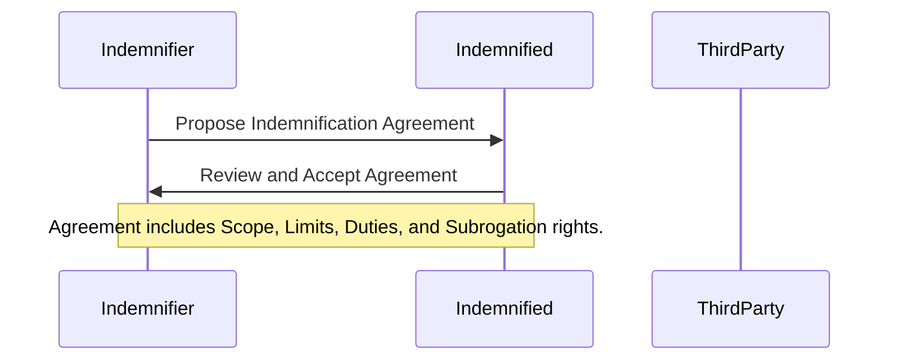
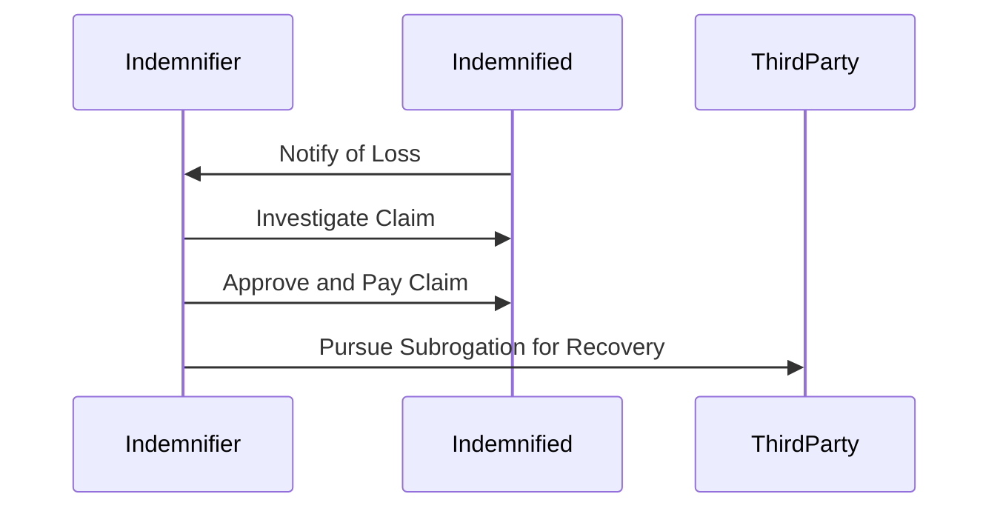
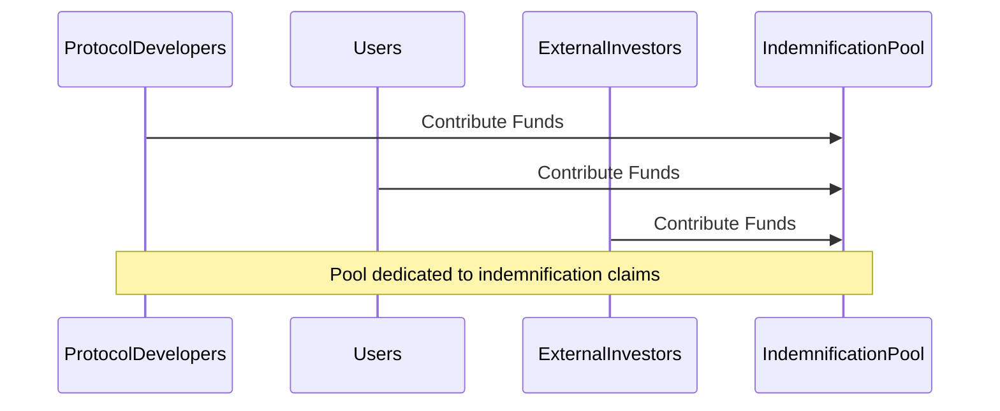
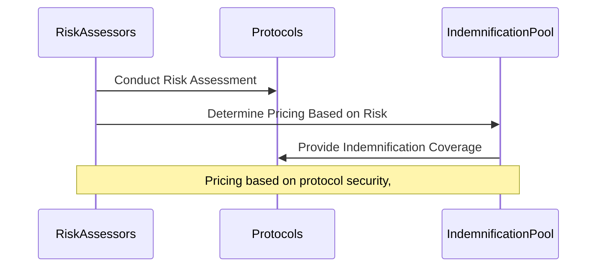
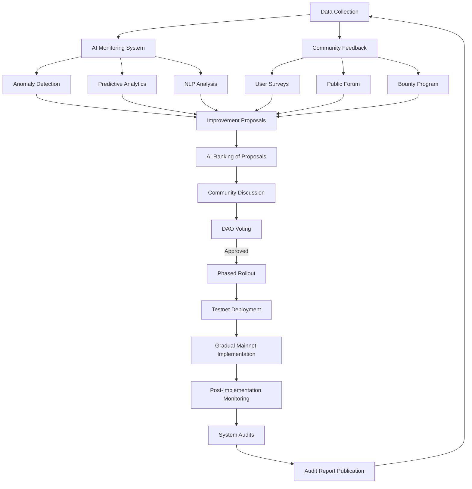

### 3.1 Indemnification Agreement

```mermaid
sequenceDiagram
    participant Indemnifier
    participant Indemnified
    participant ThirdParty
    Indemnifier->>Indemnified: Propose Indemnification Agreement
    Indemnified->>Indemnifier: Review and Accept Agreement
    Note over Indemnifier,Indemnified: Agreement includes Scope, Limits, Duties, and Subrogation rights.
```
### 3.2 Claims Process

```mermaid
sequenceDiagram
    participant Indemnifier
    participant Indemnified
    participant ThirdParty
    Indemnified->>Indemnifier: Notify of Loss
    Indemnifier->>Indemnified: Investigate Claim
    Indemnifier->>Indemnified: Approve and Pay Claim
    Indemnifier->>ThirdParty: Pursue Subrogation for Recovery
```

### 5.1 Establishment of Indemnification Pool

```mermaid
sequenceDiagram
    participant ProtocolDevelopers
    participant Users
    participant ExternalInvestors
    participant IndemnificationPool
    ProtocolDevelopers->>IndemnificationPool: Contribute Funds
    Users->>IndemnificationPool: Contribute Funds
    ExternalInvestors->>IndemnificationPool: Contribute Funds
    Note over ProtocolDevelopers,IndemnificationPool: Pool dedicated to indemnification claims
```

### Risk Assessment and Pricing

```mermaid
sequenceDiagram
    participant RiskAssessors
    participant Protocols
    participant IndemnificationPool
    RiskAssessors->>Protocols: Conduct Risk Assessment
    RiskAssessors->>IndemnificationPool: Determine Pricing Based on Risk
    IndemnificationPool->>Protocols: Provide Indemnification Coverage
    Note over RiskAssessors,IndemnificationPool: Pricing based on protocol security,
```

```mermaid!
graph TD
    A[Data Collection] --> B[AI Monitoring System]
    A --> C[Community Feedback]
    B --> D[Anomaly Detection]
    B --> E[Predictive Analytics]
    B --> F[NLP Analysis]
    C --> G[User Surveys]
    C --> H[Public Forum]
    C --> I[Bounty Program]
    D --> J[Improvement Proposals]
    E --> J
    F --> J
    G --> J
    H --> J
    I --> J
    J --> K[AI Ranking of Proposals]
    K --> L[Community Discussion]
    L --> M[DAO Voting]
    M -->|Approved| N[Phased Rollout]
    N --> O[Testnet Deployment]
    O --> P[Gradual Mainnet Implementation]
    P --> Q[Post-Implementation Monitoring]
    Q --> R[System Audits]
    R --> S[Audit Report Publication]
    S --> A
```